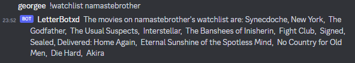

# Discord-Letterboxd integration bot

A bot for accessing data on letterboxd from within a discord server.

Uses BeautifulSoup and a html scraper as the Letterboxd API was very unhelpful.

## Aims

* Provide a list of favourite films of users of letterboxd
* Provide recently watched films from letterboxd

* Provide a watchlist from different users

* Update the server when a user watches a film if possible??

